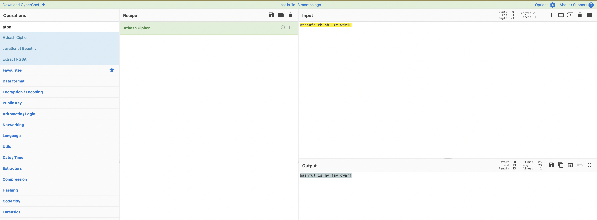

# A to Z
This challenge provided us with the prompt:
> This encrypted flag will only require a simple substitution cipher to solve. Rearrange the letters from A to Z.
> yzhsufo_rh_nb_uze_wdziu

The prompt suggests that this is a substitution cipher. Running it through Cyberchef with ROT13, it yields nothing but gibberish.
The name of the challenge is a hint in itself. It implies that A becomes Z, and in turn, B becomes Y, C becomes X, etc. This is an atbash cipher. 

I used CyberChef once again, which revealed the flag:

> bashful_is_my_fav_dwarf
 