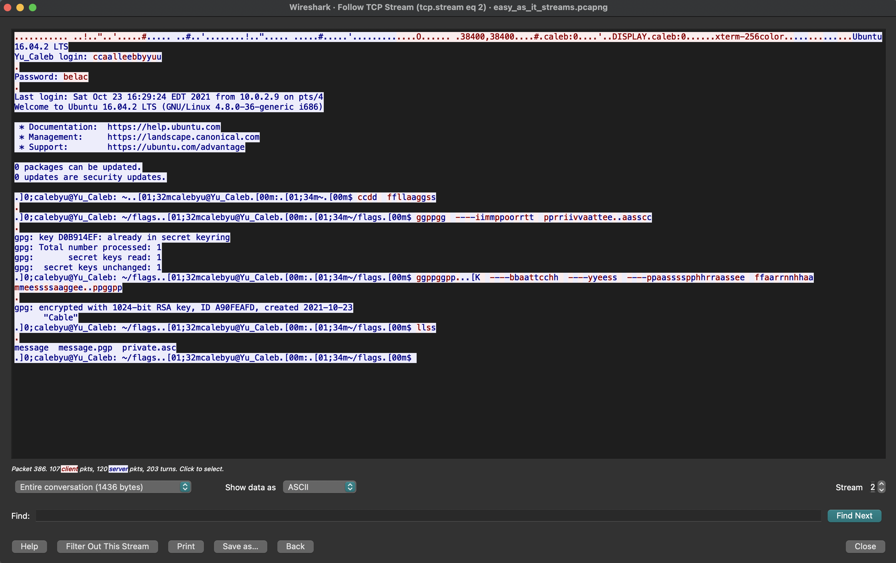
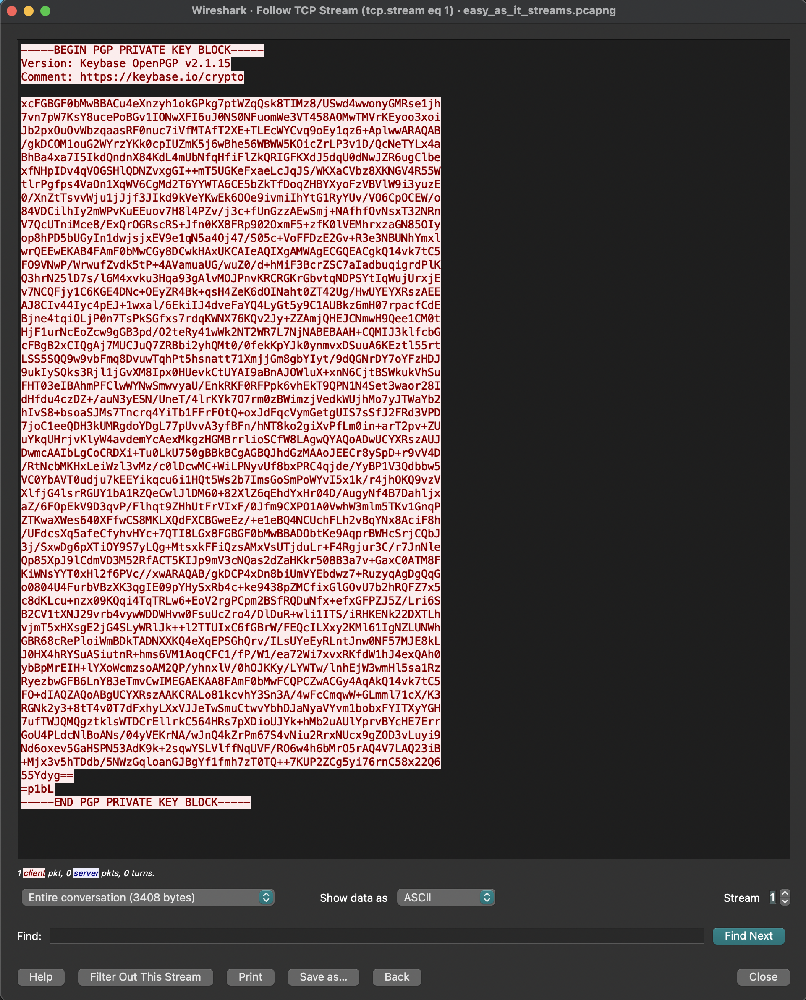
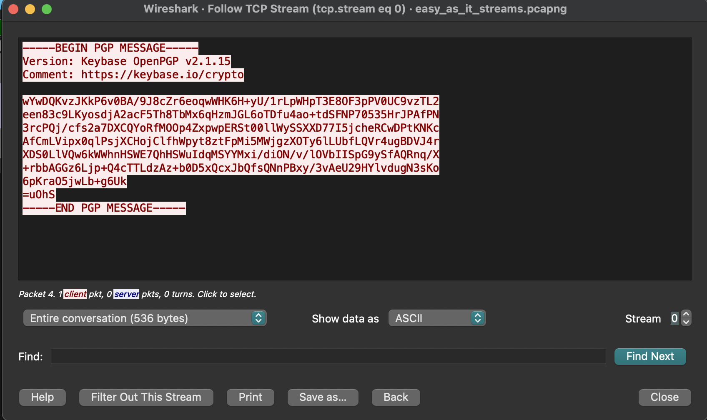
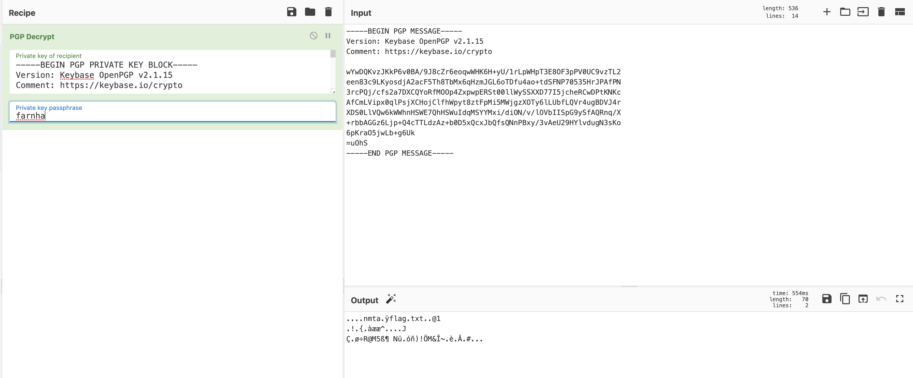

# Easy As (TCP) Streams

This challenge provided us with a pcap file containing a bunch of TCP and Telnet traffic. Obviously, you'll want to open this in Wireshark or a similar command line program. First thing I did was filter for Telnet traffic, right click on any of the packets, and click "Follow" -> "TCP Stream" 

Here we can see that a user was using gpg to encrypt a message, likely containing the flag. You'll notice in the bottom left, that this is stream 2, suggesting there are 2 other TCP streams that may be of interest. 
## Stream 1

## Stream 0

Streams 1 and 0 are a PGP private key, and a PGP encrypted message respectively. The problem prompt indicated that we should use CyberChef to decode these rather than a command line utility like gpg. From Stream 2, we saw that the password used to encrypt the message was: 
> farnha

Using CyberChef to decrypt and find the flag:

The fun little magic wand indicates that this is a .gz file. Using the gunzip feature in our recipe on CyberChef yields the flag: 

> MetaCTF{cleartext_private_pgp_keys}