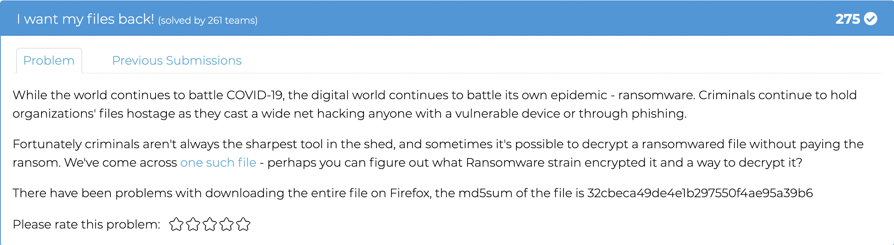
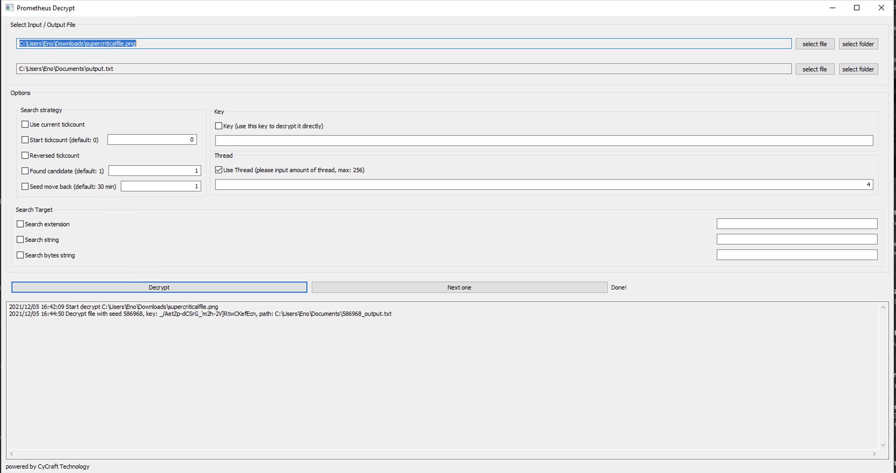

# I want my files back

The name of the file that is downloaded from the link has `[AA4-MX4-GGQD]` apended to the end of the extension. I googled this string because it looked weird to me. The first link that came up was https://tria.ge/210528-43bj78bba6. This page indicates that it is likely a strain of ransomware called Prometheus. 

Some more googling led me to this article, describing a tool used to decrypt files that have been encrypted by Prometheus: https://medium.com/cycraft/prometheus-decryptor-6933e7bac1ea. 

I used the windows GUI application, which prompted me for an input file, output file, and how many threads I'd like to use to brute force. I let it go for a while, worked on some other challenges, and came back to success! 

Opening the output file it created opened it in notepad. It had "PNG" in the first line so I tried opening it in MS Paint lol. 

The flag was: 
> MetaCTF{how_did_the_hacker_escape_he_ransomware}