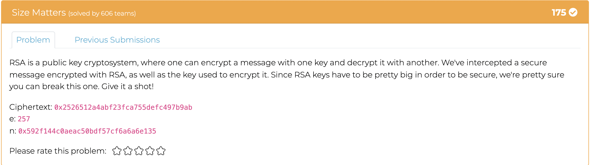
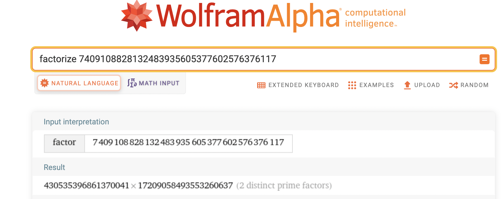
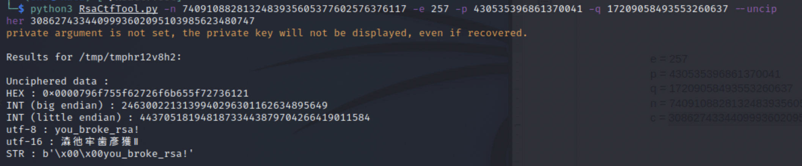

# Size Matters

This challenge provided us with a large number n, a ciphertext, and a small e value. It also indicated that it was RSA encrypted. First I began by converting the ciphertext and n out of hexadecimal. The values that resulted are

`n = 7409108828132483935605377602576376117`

`ciphertext = 3086274334409993602095103985623480747`

From here, I figured I would just try and find p and q from n, by finding the prime factors. For this I used wolframalpha. 

This gave me the two values p and q:

`p = 430535396861370041`

`q = 17209058493553260637`

With all of this, cracking the RSA is trivial using the tool RsaCtfTool.py (found here: https://github.com/Ganapati/RsaCtfTool). Simply supply it with the ciphertext, p, q, n, and e and it will give the plaintext. 

The flag was:
> MetaCTF{you_broke_rsa!}