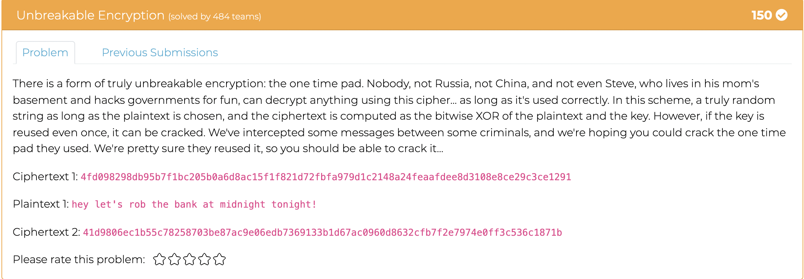
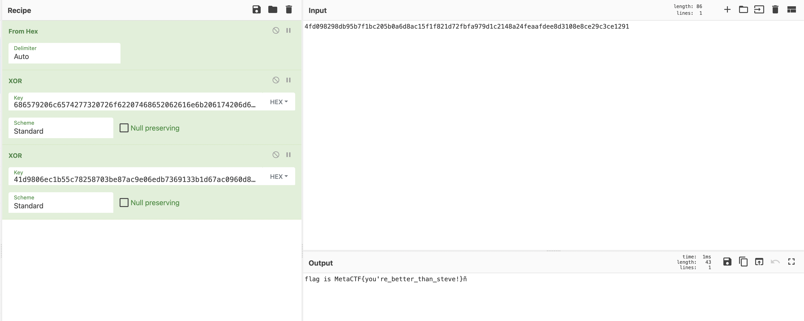

# Unbreakable Encryption

This probem provided us with two ciphertexts, and explained that the same one-time-pad had been used for both. It also provided us with the plaintext of ciphertext 1. The cipher was generated using bitwise XOR. We know that A ⊕ B = C and that A ⊕ C = B. All we have to do is first convert the plaintext into hex, XOR it with ciphertext 1, which will provide us the key used for both ciphertexts. Lastly we XOR ciphertext 2 with the key and that will give us the flag. I did all of this in one recipe in CyberChef

> Flag: MetaCTF{you're_better_than_steve}